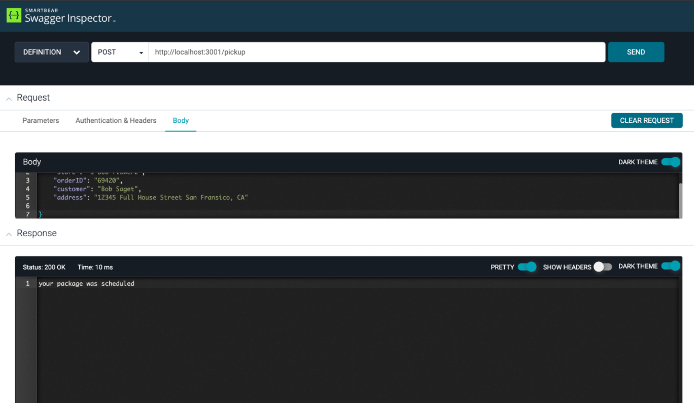
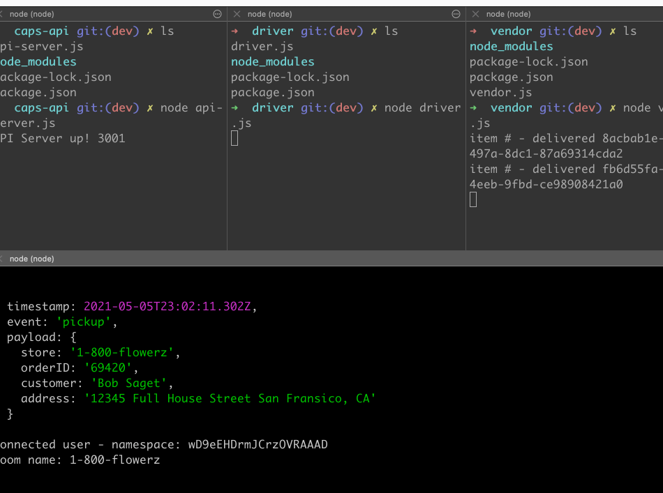

#  Lab 12: Socket.IO Delivery

## Overview

Its and app that uses socket.io to communicate to all the separate folders. When all the apps are running you will see a delivery tracker that logs the time and info of each item delivered

## Getting started

To start the app you must open a separate terminal for each folder. Once this is done you run each individual file inside the folder with the command `node <filename>`.

## Dependencies

- socket.io

- socket.io-client

- cors

- express

- faker

## Swagger

Here is me using swagger to send a POST with an object with said info


## Terminal

Here is the terminal showing the post



## Data Model

```
{
    "store": "1-800-flowerz,"
    "orderID": "69420",
    "customer": "Bob Saget",
    "address": "12345 Full House Street San Fransico, Ca"
}
```
